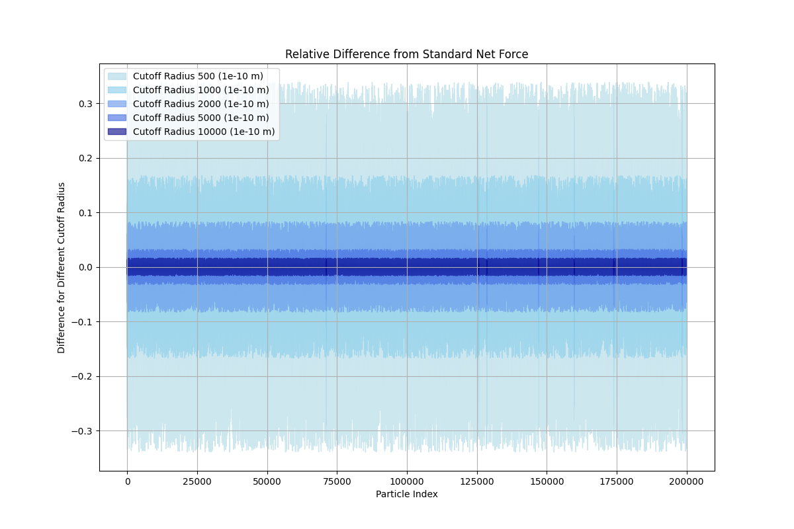
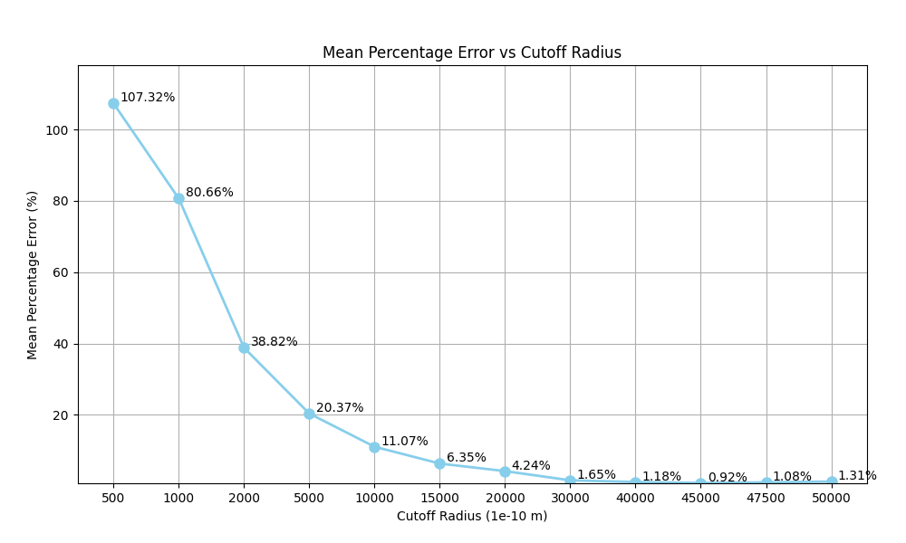
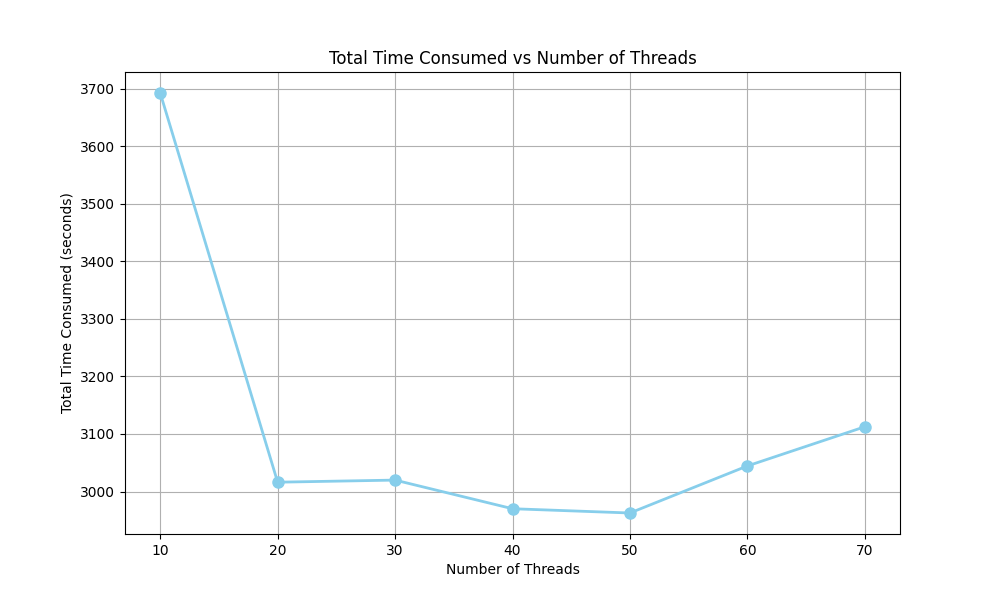
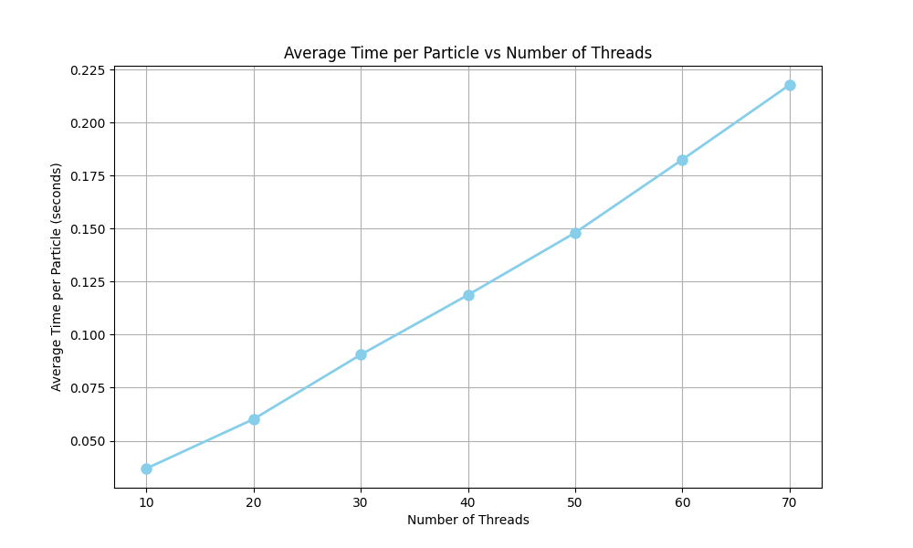

## Electrostatic_Particle_Simulation
A Range-Limited Electrostatic N-Particle Simulation.


### Usage
```text
Usage: nParticleSim [OPTIONS]
Options:
--mode              Select Mode {1,2,3}
--cutoff_radius     Enter the cutoff radius (1e-10 m)
--input             Enter the file path for csv (particles.csv)
--num_threads       Enter number of threads in Mode 2 and 3 (for each process)
--leader            Enter number of leader process in Mode 3
```
**_e.g_**
```shell
./nParticleSim --mode=1 --cutoff_radius=45000 --input=../dataset/particles.csv 
```
```shell
./nParticleSim --mode=2 --cutoff_radius=47500 --input=../dataset/particles.csv --num_threads=50
```
```shell
mpirun -np 2 ./nParticleSim --mode=3 --cutoff_radius=45000 --input=../dataset/particles.csv --num_threads=10
```
### Mode 1: Sequential Computation
> This implementation is entirely serial. No multithreading, just the approximation method  
applied to compute the signed scalar force sums on every particle. 

**Input parameters:**
```shell
./nParticleSim --mode=1 --cutoff_radius={%d} --input=../dataset/particles.csv 
```

#### Area Chart for Different Cutoff Radius


#### Mean Percentage Error for Different Cutoff Radius


### Mode 2: Evenly-Distributed Parallel Computation
> In this implementation, I use the `std::thread` execution model to create multiple threads and 
divide the computation among the threads. I divide the dataset among the threads at the point in 
time when the thread is created, so that once it finishes its given portion of work, it returns. 
The work is as evenly as possible divided among the threads. 

**Input parameters:**
```shell
./nParticleSim --mode=2 --cutoff_radius={%d} --input=../dataset/particles.csv --num_threads={%d}
```

#### Total Time Consumed vs Number of Threads
`--cutoff_radius=45000`


#### Average Time per Particle vs Number of Threads
`--cutoff_radius=45000`



### Mode 3: Load-Balanced, Leader-Based Parallel Computation
> In this implementation, you will begin by creating leader processes using MPI. Each leader must be given an 
equal partition of the dataset. Each leader creates a pool of worker threads in the form of Pthreads/threads. 
Each leader’s partition of the data must be further partitioned into smaller chunks and placed into a queue that 
can be accessed by all of its worker threads. Worker threads must take one small chunk of data at a time, execute 
the necessary computation, and then return to the queue to take more work. Threads only return once the queue is 
empty and all work is done. The number of leader processes and worker threads and the cutoff radius must be input 
parameters for this mode.

```shell
mpirun -np {%num_of_leaders} ./nParticleSim --mode=3 --cutoff_radius=45000 --input=../dataset/particles.csv --num_threads={%d}
```


### _Hardware Resources_
```text
System:     macOS Sonoma Version 14.3.1
Chip:       Apple M3 Max
Memory:     48 GB
Core:       16-core CPU and 40-core GPU (400GB/s memory bandwidth)
```