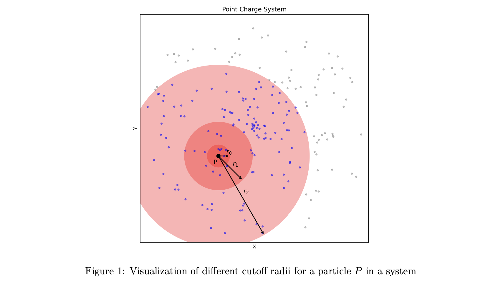

## Electrostatic_Particle_Simulation
A Range-Limited Electrostatic N-Particle Simulation.


### Usage
```text
Usage: nParticleSim [OPTIONS]
Options:
--mode              Select Mode {1,2,3}
--cutoff_radius     Enter the cutoff radius (1e-10 m)
--input             Enter the file path for csv (particles.csv)
--num_threads       Enter number of threads in Mode 2 and 3 (for each process)
--leader            Enter number of leader process in Mode 3
```

### Build and Run
```shell
mkdir build
cd build
cmake ..
cmake --build .
```
**_e.g_**
```shell
// Mode 1
./nParticleSim --mode=1 --cutoff_radius=45000 --input=../dataset/particles.csv 
```
```shell
// Mode 2
./nParticleSim --mode=2 --cutoff_radius=47500 --input=../dataset/particles.csv --num_threads=50
```
> [!TIP]
> Inorder to run program in mode 3, `mpirun -np {#_of_leaders}` is REQUIRED.
```shell
// Mode 3
mpirun -np 2 ./nParticleSim --mode=3 --cutoff_radius=45000 --input=../dataset/particles.csv --num_threads=10
```

### Repo Structure
```text
\ main.cpp --> main program
\ CMakeLists.txt
\ Particle
    \ Particle.cpp
        --> struct ParticleData
        --> class Particle
        --> class CoulombForceCalculator
    \ ParticleReader.cpp
        --> class ParticleReader
\ Sequential
    \ Sequential.cpp # Mode 1: Sequential Model
\ Distributed
    \ Parallel.cpp # Mode 2: Evenly-Distributed Parallel Computation Model
\ Leader
    \ Leader.cpp # Mode 3: Load-Balanced, Leader-Based Parallel Computation Model
\ hist_data    
    \ chart (charts generated by python scripts)
    \ * :
        generated data & python scripts
\ dataset --> input data path
```
### Mode 1: Sequential Computation
> [!NOTE]
> This implementation is entirely serial. No multithreading, just the approximation method  
applied to compute the signed scalar force sums on every particle. 

**Input parameters:**
```shell
./nParticleSim --mode=1 --cutoff_radius={%d} --input=../dataset/particles.csv 
```


[//]: # (#### Area Chart for Different Cutoff Radius)

[//]: # (![](hist_data/chart/area_line_chart_cr.png))
[//]: # ()
#### Mean Percentage Error for Different Cutoff Radius

**_Run, Test and Generate Graph_**
```shell
// activate virtual env
source venv/bin/activate

// GOTO directory
cd hist_data/cr

// the output files I provided have the format of output_parallel_{%d}.csv where {%d} is the
// cutoff radius. you can use whatever mode you want to generate result and rename it in the 
// same format and add the cutoff radius in the list in the script.
python3 output_parallel_mape.py
```

### Mode 2: Evenly-Distributed Parallel Computation
> [!NOTE]
> In this implementation, I use the `std::thread` execution model to create multiple threads and 
divide the computation among the threads. I divide the dataset among the threads at the point in 
time when the thread is created, so that once it finishes its given portion of work, it returns. 
The work is as evenly as possible divided among the threads. 

**Input parameters:**
```shell
./nParticleSim --mode=2 --cutoff_radius={%d} --input=../dataset/particles.csv --num_threads={%d}
```


#### Total Time Consumed vs Number of Threads
> [!IMPORTANT]
> `--cutoff_radius=45000`


**_Run, Test and Generate Graph_**
```shell
// activate virtual env
source venv/bin/activate

// GOTO directory
cd hist_data/mode_2_threads_compare

// the output files I provided have the format of timing_cutoff_{radius}_threads_{%d}.csv where {%d} is the
// number of threads. Use Mode 2 generate result txt files; The Mode 2 will record the time consumed and save
// the result in the txt file.
python3 threads_compare.py // this is Graph 1
```
#### Average Time per Particle vs Number of Threads
> [!IMPORTANT]
> `--cutoff_radius=45000`


**_Run, Test and Generate Graph_**
```shell
// activate virtual env
source venv/bin/activate

// GOTO directory
cd hist_data/mode_2_threads_compare

// the output files I provided have the format of timing_cutoff_{radius}_threads_{%d}.csv where {%d} is the
// number of threads. Use Mode 2 generate result txt files; The Mode 2 will record the time consumed and save
// the result in the txt file.
python3 threads_compare.py // this is Graph 2
```

### Mode 3: Load-Balanced, Leader-Based Parallel Computation
> [!NOTE]
> In this implementation, I implement load-balanced, leader-based computation using [Open MPI](https://www.open-mpi.org/). Each leader is given an 
equal partition of the dataset. Each leader creates a pool of worker threads in the form of `threads`. 
Each leader’s partition of the data will be further partitioned into smaller chunks and placed into a `worker queue` that 
can be accessed by all of its worker threads. Worker threads take one small chunk of data at a time, execute 
the necessary computation, and then return to the queue to take more work. Threads only return once the queue is 
empty and all work is done. 

```shell
mpirun -np {%num_of_leaders} ./nParticleSim --mode=3 --cutoff_radius=45000 --input=../dataset/particles.csv --num_threads={%d}
```


#### Average Computation Time vs Number of Leaders
> [!IMPORTANT]
> `--cutoff_radius=45000` , `--num_threads=10`


**_Run, Test and Generate Graph_**
```shell
// activate virtual env
source venv/bin/activate

// GOTO directory
cd hist_data/mode_3

// use leader_process_executions.py to automatically run the program with different 
// number of leaders and threads
python3 leader_process_executions.py

// Graph 1 is Average Computation Time vs Number of Leaders
python3 comparision_of_total_computation.py
```

#### Mode 2 vs Mode 3 (same number of threads)
> [!IMPORTANT]
> `--cutoff_radius=45000`


**_Run, Test and Generate Graph_**
```shell
// activate virtual env
source venv/bin/activate

// GOTO directory
cd hist_data/mode_3

// use leader_process_executions.py to automatically run the program with different 
// number of leaders and threads
python3 leader_process_executions.py

// Graph 2 is Total Computation Time vs Number of Threads (different mode)
python3 comparision_of_total_computation.py
```
### _Hardware Resources_
```text
System:     macOS Sonoma Version 14.3.1
Chip:       Apple M3 Max
Memory:     48 GB
Core:       16-core CPU and 40-core GPU (400GB/s memory bandwidth)
```